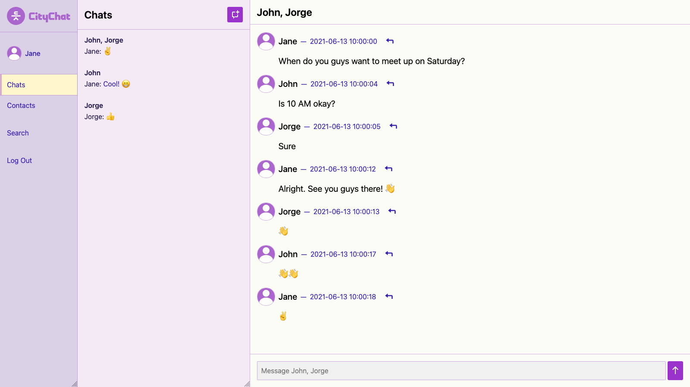
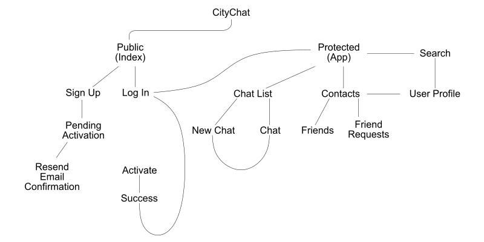

# CityChat

CCNY Fall 2020 CSc 59976 Final Project




## Overview

CityChat is a general-purpose chat app built with Flask, PostgreSQL, and React. With both direct and group messaging capabilities, CityChat is flexible for your needs. Unlike our competitors, CityChat takes a "chat first" approach.


## Getting Started


### CityChat Client

To change the working directory to `client`, run:

```bash
cd client
```

To use the default environment variables, run:

```bash
cp .env.example .env
```

To install all dependencies, run:

```bash
npm install
npm install --only=dev
```

To start the client, run:

```bash
npm start
```

Open <http://localhost:3000> to view it in the browser.


### CityChat Server

To change the working directory to `server`, run:

```bash
cd server
```

To use the default environment variables, run:

```bash
cp .env.example .env
```

To create and start a virtual environment with Python 3.9.0 and the required packages, run:

```bash
pyenv local 3.9.0
eval "$(pyenv init -)"
virtualenv venv
source venv/bin/activate
pip install -r requirements.txt
```

To start the virtual environment, run:

```bash
source venv/bin/activate
```

Start the PostgreSQL server on `postgresql://localhost` before starting the CityChat server.

To create all tables, run:

```bash
flask db upgrade
```

To start the server, run:

```bash
python app.py
```

Open <http://localhost:5000/public/signup> to confirm the server has started.


## Requirements

- Node 10
  - npm
- PostgreSQL 13
- Python 3.9
  - pip


## Data Model

The application will store:

- users (`user`)
  - user profiles (`user_profile`)
  - user relationships (`user_relationship`)
- blacklisted JSON web tokens (`jwt_blacklist`)
- chats (`chat`)
  - chat participants (`chat_participant`)
  - one-one-one chats (`direct_chat`)
  - group chats (`group_chat`)
- messages (`message`)
  - message contents (`message_text`)

The data will have the following relationships:

- One-to-one
  - `user` and `user_profile`
  - `user` and `chat_participant`
  - `chat` and `direct_chat`
  - `chat` and `group_chat`
  - `message` and `message_text`
- One-to-many
  - `user` and `jwt_blacklist`
  - `user` and `message`
  - `chat` and `chat_participant`
  - `chat` and `message`
- Many-to-many
  - `user` and `user_relationship`


# Sample Resources

An example `user`:

```javascript
{
  id: 1
  password: null, // redacted
  date_registered: '2020-12-15 0:00:00.000000',
  date_activated: '2020-12-15 0:00:01.000000'
}
```

An example `user_profile`:

```javascript
{
  id: 1, // references user.id
  email: 'citychatuser@example.com',
  name: 'CityChat User'
}
```

An example `user_relationship`:

```javascript
{
  user_a: 1, // references user.id
  user_b: 2, // references user.id
  relation: 'F', // friend
  since: '2020-12-15 0:00:03.000000'
}
```

An example `jwt_blacklist`:

```javascript
  id: 1,
  audience: 1, // references user.id
  jti: '01234567-89ab-cdef-0123-456789abcdef',
  token_type: 'access',
  issue_date: '2020-12-15 0:00:02.000000',
  expiration_date: '2020-12-15 0:15:02.000000'
```

An example `chat`:

```javascript
{
  id: 1
}
```

An example `chat_participant`:

```javascript
{
  chat_id: 1, // references chat.id
  participant_id: 2, // references user.id
  nickname: 'Nickname'
}
```

An example `direct_chat`:

```javascript
{
  id: 1 // references chat.id
}
```

An example `group_chat`:

```javascript
{
  id: 1, // references chat.id
  name: 'CityChat Group'
}
```

An example `message` without reply:

```javascript
{
  id: 1,
  chat_id: 1, // references chat.id
  author_id: 1, // references user.id
  timestamp: '2020-12-15 0:00:04.000000',
  parent_id: null // references message.id
}
```

An example `message` with reply:

```javascript
{
  id: 2,
  chat_id: 1, // references chat.id
  author_id: 2, // references user.id
  timestamp: '2020-12-15 0:00:05.000000',
  parent_id: 1 // references message.id
}
```

An example `message_text`:

```javascript
{
  id: 1, // references message.id
  content: 'The quick brown fox jumps over the lazy dog'
}
```


## Site Map




## User Stories or Use Cases

- As a visitor, I can
  - Sign up for a new CityChat account
  - Log into my CityChat account
- As a user, I can
  - Search for users, so that I can
    - Send users friend requests
  - Accept or reject friend requests from other users, so that I can
    - Add my friends to my contacts list
  - Start a one-on-one chat, so that I can
    - Talk to an individual user
  - Start a group chat, so that I can
    - Talk to multiple users
  - Send messages in a chat
  - Reply to messages in a chat
  - Log out, so that I can
    - Log into another account
    - Take a break


## References Used

- <https://blake.id/react-global-state-in-5-minutes-with-hooks-usecontext-usereducer/>
- <https://blog.bearer.sh/add-retry-to-api-calls-javascript-node/>
- <https://developer.mozilla.org/en-US/docs/Web/API/AbortController>
- <https://developer.mozilla.org/en-US/docs/Web/API/Fetch_API>
- <https://flask-jwt-extended.readthedocs.io/en/stable/blacklist_and_token_revoking/>
- <https://flask-jwt-extended.readthedocs.io/en/stable/changing_default_behavior/?highlight=loader>
- <https://flask-jwt-extended.readthedocs.io/en/stable/tokens_in_cookies/>
- <https://flask-socketio.readthedocs.io/en/latest/>
- <https://flask.palletsprojects.com/en/1.1.x/patterns/viewdecorators/>
- <https://flaviocopes.com/javascript-sleep/>
- <https://hackersandslackers.com/flask-blueprints/>
- <https://pythonhosted.org/Flask-Mail/>
- <https://reactjs.org/docs/hooks-reference.html>
- <https://socket.io/docs/v3/client-api/index.html>


## Authors

Kangming Deng
